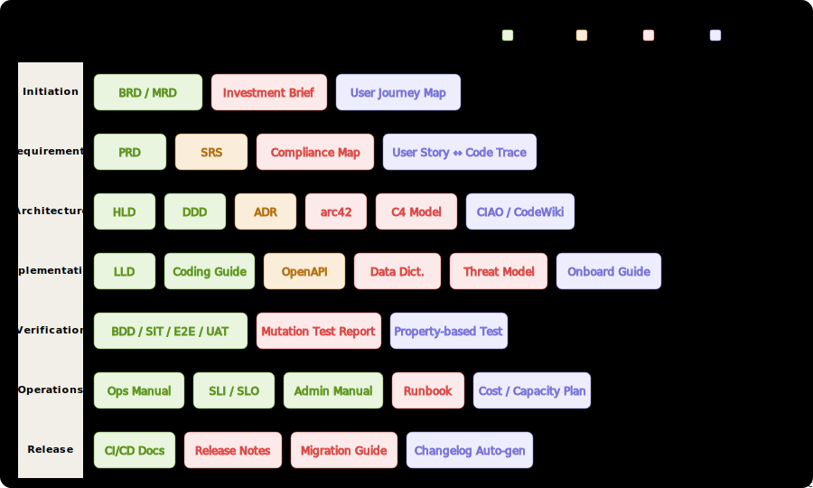

**English** | [中文](./README.zh-CN.md)

<div align="center">

# 🔍 code2doc

**Reverse-engineer business logic from code. Generate professional documentation covering the entire software delivery lifecycle.**

[](LICENSE)
[](https://docs.anthropic.com/claude-code)
[](https://opencode.ai)
[](https://cursor.sh)
[](https://clawhub.ai/suifei/lang-migration)

*Documentation drift is entropy, not negligence. Code has CI/lint/compiler errors as feedback loops — documentation has none, so it inevitably rots.*
*code2doc is the solution: treat code as the single source of truth, and continuously generate or calibrate documentation.*

</div>

---

ClawHub: [https://clawhub.ai/suifei/code-to-doc-generator](https://clawhub.ai/suifei/code-to-doc-generator)

Skillhub:[https://skillhub.cn/skills/code-to-doc-generator](https://skillhub.cn/skills/code-to-doc-generator)

## Coverage



---

## What It Does

Given any code repository (web, backend services, mobile, desktop), code2doc can reverse-engineer and generate **12 standard software delivery documents**:

| Phase | Document Type | Target Audience |
|-------|--------------|-----------------|
| Initiation | BRD (Business Requirements) · MRD (Market Requirements) | Executives, Investors |
| Requirements | PRD (Product Requirements) | Product Managers, Tech Leads |
| Architecture | HLD (High-Level Design) · DDD (Domain-Driven Design) | Architects, Tech Leads |
| Implementation | LLD (Low-Level Design) · Coding Guidelines | Developers |
| Verification | Test Documents (BDD/SIT/E2E/UAT) | QA Engineers |
| Operations | Ops Manual · Admin Quick Reference · SLI/SLO Monitoring | Ops Staff, SRE |
| Release | CI/CD Pipeline Documentation | DevOps Engineers |

### Core Features

- **Code as Truth**: All content is extracted directly from code. Inferences are marked with `〔INFER〕`, code facts are traced with `〔FACT｜file:line〕`
- **Audience-Adaptive**: Ops manuals avoid technical jargon; HLD/LLD retain precise engineering language; BRD/MRD are fully business-oriented for executives
- **Reverse Sync**: Run `Reverse Sync Mode` after code changes to automatically detect documentation drift and calibrate
- **Rigorous Structure**: Ops documents require 🔗 prerequisite dependency chains + 📊 impact tracking matrices (including underlying algorithm/strategy names)
- **Any Tech Stack**: Go · Python · Node.js · Java · Swift · Kotlin · Flutter · React · Vue · Electron

---

## Installation & Usage

### Claude Code (Recommended)

[Claude Code](https://docs.anthropic.com/claude-code) is Anthropic's official CLI tool with native skill format support.

**Option A: Project-Level (current project only)**

```bash
# Run in project root
mkdir -p .claude/skills
git clone https://github.com/suifei/code2doc .claude/skills/code2doc
```

Add to your project's `CLAUDE.md`:

```markdown
## Skills

@.claude/skills/code2doc/SKILL.md
```

**Option B: Global (all projects)**

```bash
mkdir -p ~/.claude/skills
git clone https://github.com/suifei/code2doc ~/.claude/skills/code2doc
```

Add to `~/.claude/CLAUDE.md`:

```markdown
## Skills

@~/.claude/skills/code2doc/SKILL.md
```

**Usage:**

```
# Generate an operations manual
> Generate operations manual

# Generate HLD
> Write HLD for me

# Reverse sync — code changed but docs are out of date
> Sync documentation
```

---

### OpenCode

[OpenCode](https://opencode.ai) supports the same skill directory structure as Claude Code.

```bash
# Clone to OpenCode's skills directory
mkdir -p ~/.opencode/skills
git clone https://github.com/suifei/code2doc ~/.opencode/skills/code2doc
```

Register in `~/.opencode/config.toml`:

```toml
[[skills]]
path = "~/.opencode/skills/code2doc/SKILL.md"
```

Or via the OpenCode UI: `Settings → Skills → Add from path`

**Usage:** Type `/code2doc` in the chat or directly describe your documentation needs.

---

### Cursor

Cursor loads rules from the `.cursor/rules/` directory (`.mdc` format).

```bash
# In project root
mkdir -p .cursor/rules

# Convert SKILL.md to Cursor rules format
curl -fsSL https://raw.githubusercontent.com/suifei/code2doc/main/SKILL.md \
  -o .cursor/rules/code2doc.mdc
```

Or manually:

1. Open Cursor → `Cursor Settings` → `Rules for AI`
2. Paste the contents of [`SKILL.md`](./SKILL.md) into the `User Rules` area
3. Request a document type directly in the chat:

```
Generate HLD for this project
```

**Global rules (all projects):**

```
Cursor Settings → General → Rules for AI → Paste SKILL.md content
```

---

### Cline / RooCode (VSCode Extensions)

[Cline](https://github.com/cline/cline) and [RooCode](https://github.com/RooVetGit/Roo-Code) support custom System Prompts.

1. Open VSCode → Click the Cline/RooCode icon in the sidebar
2. Click the settings gear → `Custom Instructions`
3. Paste the full contents of [`SKILL.md`](./SKILL.md)
4. Click save

**Usage:**

```
# Enter directly in the Cline chat
Generate operations manual

# Or specify modules
Generate LLD for user and channel modules
```

---

### Continue.dev

[Continue](https://continue.dev) supports custom slash commands via `config.json`.

Edit `~/.continue/config.json`:

```json
{
  "customCommands": [
    {
      "name": "code2doc",
      "description": "Generate project documentation from code",
      "prompt": "{{{ input }}}\n\n---\n{{{ read_file '.claude/skills/code2doc/SKILL.md' }}}"
    }
  ]
}
```

Install the skill file:

```bash
mkdir -p .claude/skills
git clone https://github.com/suifei/code2doc .claude/skills/code2doc
```

**Usage:**

```
/code2doc Generate PRD for this project
```

---

### Windsurf

Windsurf loads instructions via `.windsurfrules` files or global rules.

**Project-level:**

```bash
# Create rules file in project root
curl -fsSL https://raw.githubusercontent.com/suifei/code2doc/main/SKILL.md \
  -o .windsurfrules
```

**Global:**

1. `Windsurf Settings` → `AI Rules`
2. Paste the contents of [`SKILL.md`](./SKILL.md)

**Usage:**

```
Generate HLD
```

---

### Any LLM Tool (Universal)

Use the contents of [`SKILL.md`](./SKILL.md) as a **System Prompt**. Works with any tool that supports custom System Prompts:

- **ChatGPT / OpenAI API**: Paste into System Message
- **API calls**:

```python
import anthropic

with open("SKILL.md", "r") as f:
    skill_content = f.read()

client = anthropic.Anthropic()
message = client.messages.create(
    model="claude-opus-4-5",
    max_tokens=8192,
    system=skill_content,
    messages=[
        {"role": "user", "content": "Generate operations manual"}
    ]
)
```

---

## File Structure

```
code2doc/
├── SKILL.md                    # Main skill file (4-round workflow + quality checks)
└── references/
    ├── document-types.md       # Section structure templates for 12 document types
    ├── document-structure.md   # Formatting specs for ops/admin manuals
    ├── analysis-dimensions.md  # Seven analysis dimensions (ops documents)
    ├── exploration-strategy.md # Code exploration strategy (scripts + high-info locations)
    └── reverse-sync.md         # Reverse sync protocol (documentation drift calibration)
```

---

## Workflow

```
User specifies document type
       │
       ▼
  Round 1: Identify project type & entry points
  (Read root dir → Identify tech stack → Existing docs → Initial module list)
       │
       ▼
  Round 2: Structural scan & information skeleton extraction
  (Routes/menus → i18n strings → Data models → Permission rules → Business rules)
       │
       ▼
  Round 3: Per-module deep analysis
  (Analysis dimensions vary by doc type: steps/state impact/business rules/dependencies...)
       │
       ▼
  Round 4: Document generation
  (Template skeleton → Fill content → FACT/INFER annotations → Save)
       │
       ▼
  Post-completion: Documentation sync rule
  (Search related docs → Choose one: Consistent/Update/Adjudicate)
```

---

## Reverse Sync Mode

Code changed but docs didn't keep up? Use reverse sync:

```
Code changed but docs are out of date
```

The skill automatically enters `Practice-as-Truth Reverse Sync` mode:

1. Build artifact inventory (distinguish PRACTICE vs DESCRIPTION)
2. Full code review, extract FACTS + OBSERVATIONS
3. Diff comparison (Consistent / Drifted / Missing / Zombie)
4. Write back revisions
5. Generate `OBSERVATIONS.md` (issue tracking)

---

## Quality Standards

| Check | Standard |
|-------|----------|
| Audience Fit | Language depth matches target readers (ops ≠ dev ≠ QA) |
| Annotation Completeness | Inferences have `〔INFER〕`, code facts have `〔FACT｜file:line〕`; zero annotations = execution failure |
| Flowcharts | Multi-step operations / decision branches include Mermaid diagrams |
| Unambiguous Terminology | Technical terms are translated for the audience; BRD/MRD/PRD must not use raw terms like API/Token |
| Prerequisite Dependencies | Each chapter of ops documents has 🔗 dependency chains |
| Impact Matrix | Each chapter of ops documents has 📊 matrix with strategy names in column 4 |
| No "TBD" Promises | Uncertain items are resolved (pick one of three options); "follow up later" is prohibited |

---

## License

MIT © [suifei](https://github.com/suifei)
