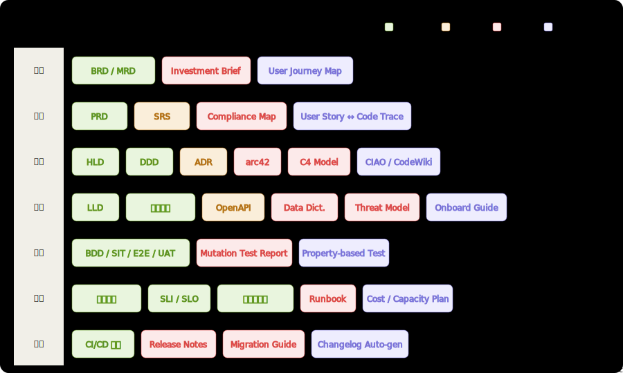

[English](./README.md) | **中文**

<div align="center">

ClawHub: [https://clawhub.ai/suifei/code-to-doc-generator](https://clawhub.ai/suifei/code-to-doc-generator)

Skillhub:[https://skillhub.cn/skills/code-to-doc-generator](https://skillhub.cn/skills/code-to-doc-generator)

# 🔍 code2doc

**从代码逆向提取业务逻辑，生成覆盖软件交付全链路的专业文档**

[](LICENSE)
[](https://docs.anthropic.com/claude-code)
[](https://opencode.ai)
[](https://cursor.sh)

*文档漂移是熵增，不是疏忽。代码有 CI/lint/编译错误作反馈回路，文档没有——它必然腐烂。*  
*code2doc 是解法：以代码为唯一真相源，持续生成或校准文档。*

</div>

---

## 覆盖范围



---

## 它能做什么

给定任意代码仓库（Web、后端服务、移动端、桌面应用），code2doc 可以逆向分析并生成 **12 种标准软件交付文档**：

| 阶段 | 文档类型 | 目标受众 |
|------|---------|---------|
| 立项 | BRD 商业需求文档 · MRD 市场需求文档 | 决策层、投资人 |
| 需求 | PRD 产品需求文档 | 产品经理、研发负责人 |
| 架构 | HLD 概要设计 · DDD 领域设计 | 架构师、技术负责人 |
| 实现 | LLD 详细设计 · 编码指南 | 开发者 |
| 验证 | 测试文档（BDD/SIT/E2E/UAT） | QA 工程师 |
| 运维 | 运营手册 · 管理员速查手册 · SLI/SLO 监控文档 | 运营人员、SRE |
| 发布 | CI/CD 流水线文档 | DevOps 工程师 |

### 核心特性

- **代码即真相**：所有内容直接提炼自代码，推断内容用 `〔INFER〕` 标注，代码事实用 `〔FACT｜文件:行号〕` 追踪
- **受众适配**：运营手册禁用技术术语，HLD/LLD 保留精确工程语言，BRD/MRD 面向决策层完全业务化
- **反向同步**：代码变更后执行 `反向同步模式`，自动识别文档漂移并校准
- **结构严谨**：运营类文档强制包含 🔗 前置依赖链路 + 📊 影响追踪矩阵（含底层算法/策略命名）
- **任意技术栈**：Go · Python · Node.js · Java · Swift · Kotlin · Flutter · React · Vue · Electron

---

## 安装与使用

### Claude Code（推荐）

[Claude Code](https://docs.anthropic.com/claude-code) 是 Anthropic 官方命令行工具，原生支持 skill 格式。

**方式 A：项目级安装（仅当前项目生效）**

```bash
# 在项目根目录执行
mkdir -p .claude/skills
git clone https://github.com/suifei/code2doc .claude/skills/code2doc
```

在项目 `CLAUDE.md` 中添加引用：

```markdown
## Skills

@.claude/skills/code2doc/SKILL.md
```

**方式 B：全局安装（所有项目生效）**

```bash
mkdir -p ~/.claude/skills
git clone https://github.com/suifei/code2doc ~/.claude/skills/code2doc
```

在 `~/.claude/CLAUDE.md` 中添加：

```markdown
## Skills

@~/.claude/skills/code2doc/SKILL.md
```

**使用：**

```
# 生成运营手册
> 生成运营手册

# 生成 HLD 概要设计
> 帮我写 HLD

# 反向同步——代码改了文档没跟上
> 同步文档
```

---

### OpenCode

[OpenCode](https://opencode.ai) 支持与 Claude Code 相同的 skill 目录结构。

```bash
# 克隆到 OpenCode 的 skills 目录
mkdir -p ~/.opencode/skills
git clone https://github.com/suifei/code2doc ~/.opencode/skills/code2doc
```

在 `~/.opencode/config.toml` 中注册：

```toml
[[skills]]
path = "~/.opencode/skills/code2doc/SKILL.md"
```

或通过 OpenCode 界面：`Settings → Skills → Add from path`

**使用：** 在对话框输入 `/code2doc` 或直接描述文档需求。

---

### Cursor

Cursor 通过 `.cursor/rules/` 目录加载规则文件（`.mdc` 格式）。

```bash
# 在项目根目录
mkdir -p .cursor/rules

# 将 SKILL.md 转为 Cursor rules 格式
curl -fsSL https://raw.githubusercontent.com/suifei/code2doc/main/SKILL.md \
  -o .cursor/rules/code2doc.mdc
```

或手动操作：

1. 打开 Cursor → `Cursor Settings` → `Rules for AI`
2. 将 [`SKILL.md`](./SKILL.md) 的内容粘贴到 `User Rules` 区域
3. 在对话框中直接请求文档类型：

```
生成这个项目的 HLD 概要设计文档
```

**全局规则（对所有项目生效）：**

```
Cursor Settings → General → Rules for AI → 粘贴 SKILL.md 内容
```

---

### Cline / RooCode（VSCode 扩展）

[Cline](https://github.com/cline/cline) 和 [RooCode](https://github.com/RooVetGit/Roo-Code) 支持自定义 System Prompt。

1. 打开 VSCode → 侧边栏点击 Cline/RooCode 图标
2. 点击设置齿轮 → `Custom Instructions`
3. 粘贴 [`SKILL.md`](./SKILL.md) 全部内容
4. 点击保存

**使用：**

```
# 在 Cline 对话框中直接输入
生成运营手册

# 或指定模块
为 user 和 channel 模块生成 LLD 详细设计
```

---

### Continue.dev

[Continue](https://continue.dev) 支持通过 `config.json` 定义自定义 slash 命令。

编辑 `~/.continue/config.json`：

```json
{
  "customCommands": [
    {
      "name": "code2doc",
      "description": "从代码生成项目文档",
      "prompt": "{{{ input }}}\n\n---\n{{{ read_file '.claude/skills/code2doc/SKILL.md' }}}"
    }
  ]
}
```

安装 skill 文件：

```bash
mkdir -p .claude/skills
git clone https://github.com/suifei/code2doc .claude/skills/code2doc
```

**使用：**

```
/code2doc 生成这个项目的 PRD 需求文档
```

---

### Windsurf

Windsurf 通过 `.windsurfrules` 文件或全局规则加载指令。

**项目级：**

```bash
# 在项目根目录创建规则文件
curl -fsSL https://raw.githubusercontent.com/suifei/code2doc/main/SKILL.md \
  -o .windsurfrules
```

**全局级：**

1. `Windsurf Settings` → `AI Rules`
2. 粘贴 [`SKILL.md`](./SKILL.md) 内容

**使用：**

```
生成 HLD 概要设计
```

---

### 任意 LLM 工具（通用方式）

将 [`SKILL.md`](./SKILL.md) 内容作为 **System Prompt** 使用，适用于任何支持自定义 System Prompt 的工具：

- **ChatGPT / OpenAI API**：粘贴到 System Message
- **API 调用**：

```python
import anthropic

with open("SKILL.md", "r") as f:
    skill_content = f.read()

client = anthropic.Anthropic()
message = client.messages.create(
    model="claude-opus-4-5",
    max_tokens=8192,
    system=skill_content,
    messages=[
        {"role": "user", "content": "生成运营手册"}
    ]
)
```

---

## 文件结构

```
code2doc/
├── SKILL.md                    # 主 skill 文件（四轮工作流 + 质量检查）
└── references/
    ├── document-types.md       # 12 种文档的章节结构模板
    ├── document-structure.md   # 运营手册/管理员手册格式细化规范
    ├── analysis-dimensions.md  # 七大分析维度（运营类文档专用）
    ├── exploration-strategy.md # 代码探索策略（脚本 + 高信息密度位置）
    └── reverse-sync.md         # 反向同步规程（文档漂移校准）
```

---

## 工作流

```
用户输入文档类型
       │
       ▼
  第一轮：识别项目类型与入口
  (读根目录 → 识别技术栈 → 现有文档 → 初始模块清单)
       │
       ▼
  第二轮：结构扫描与信息骨架提取
  (路由/菜单 → i18n文案 → 数据模型 → 权限规则 → 业务规则)
       │
       ▼
  第三轮：逐模块深度分析
  (按文档类型决定分析维度：操作步骤/状态影响/业务规则/关联影响...)
       │
       ▼
  第四轮：生成文档
  (按模板骨架 → 填充内容 → FACT/INFER标注 → 保存)
       │
       ▼
  完成后：文档同步铁律
  (搜索关联文档 → 三选一：一致/更新/裁决)
```

---

## 反向同步模式

代码改了但文档没跟上？使用反向同步：

```
代码改了文档没跟上
```

skill 会自动进入 `Practice-as-Truth Reverse Sync` 模式：

1. 构建产物清单（区分 PRACTICE vs DESCRIPTION）
2. 全量审视代码，提取 FACTS + OBSERVATIONS
3. 差异对照（一致 / 漂移 / 缺失 / 僵尸）
4. 回写修订
5. 生成 `OBSERVATIONS.md`（问题追踪）

---

## 质量标准

| 检查项 | 标准 |
|--------|------|
| 受众匹配 | 语言深度符合目标读者（运营 ≠ 开发 ≠ 测试） |
| 标注完整 | 推断内容有 `〔INFER〕`，代码事实有 `〔FACT｜文件:行号〕`；零标注文档视为执行失误 |
| 流程图 | 多步操作 / 决策分支有 Mermaid 图 |
| 无歧义术语 | 技术词面向受众翻译；BRD/MRD/PRD 禁用 API/Token 等原始词汇 |
| 前置依赖节 | 运营类文档每章有 🔗 依赖链路 |
| 影响矩阵节 | 运营类文档每章有 📊 矩阵，第4列含策略命名 |
| 无"待定"承诺 | 不确定项已三选一处理，禁止"后续跟进" |

---

## License

MIT © [suifei](https://github.com/suifei)
