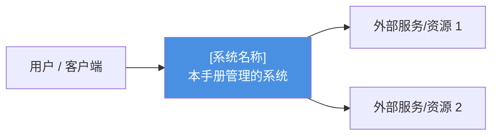
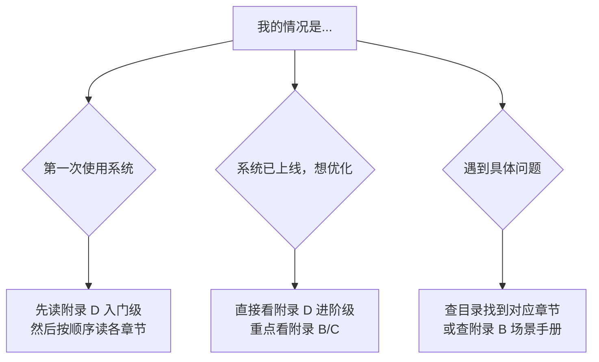

# 运营手册格式细化规范

> 本文件是 **类型 A：运营手册** 的专属格式细化，补充 `document-types.md` 中未展开的细节。  
> 其他文档类型（PRD / HLD / LLD / 编码指南 / 测试文档）请直接参考 `document-types.md`。

---

## 文档顶层结构

```
# [系统名称] 管理员业务速查手册

> 本手册面向系统使用/管理人员，以问答形式介绍所有功能、配置项及其对业务的完整影响。
> 🔴 危险 = 不可逆；🟡 注意 = 影响范围广；🟢 安全 = 可随时撤销。

## 关于本手册
  - 系统是什么？（角色定位 + Mermaid 架构图）
  - 系统的核心设计理念（设计理念表）
  - 如何使用本手册（Mermaid 决策流程图）

## 目录（自动生成）

## 第一章 ~ 第N章（业务模块）

## 附录（按需添加，数量和主题不限）
```

---

## 开篇三节（必须，在第一章之前）

### 开篇一：系统是什么

用 Mermaid 图展示系统的核心定位（「中间商」/「平台」/「工具」角色），说明系统做的 2-3 件核心事情：



### 开篇二：系统核心设计理念

输出一张表，从业务视角概括系统最重要的设计决策：

| 理念 | 含义 | 对运营的影响 |
|------|------|------------|
| [理念1] | [简洁说明] | [对运营/管理人员的实际影响] |
| [理念2] | ... | ... |

（从代码架构、配置体系、权限设计、计费逻辑等方向提炼 4-6 条）

### 开篇三：如何使用本手册

输出 Mermaid 决策流程图，帮助不同读者快速找到最适合的阅读入口：



---

## 每章固定开头（⚠️ 不可省略）

### 节 A：🔗 功能前置条件与依赖链路

```markdown
### 🔗 功能前置条件与依赖链路
> **配置依赖链路（深N层）**：[上游模块1] ➔ [上游模块2] ➔ **[当前模块]（当前）** ➔ [下游模块1] ➔ [下游模块2]
- **[前置条件名称]**：若[条件为真]，则[影响A]；若[条件为假]，则[影响B]。
- **[前置条件名称2]**：[缺失时会产生什么意料之外的副作用]。
```

写作要点：
- N = 整条链路的总节点数（数清楚，不要写错）
- 每个前置条件说明**两种情况**（开/关，有/无）
- 重点揭示：缺少某前置配置时的**意料之外的副作用**

### 节 B：📊 功能配置全局影响追踪矩阵

```markdown
### 📊 功能配置全局影响追踪矩阵

| 本模块配置项 | 影响的点 | 影响的系统功能 | 影响的算法/策略 |
|-------------|---------|--------------|----------------|
| **[配置项]** | [对象/数据] | [系统模块/功能] | **[策略名称]**：[底层策略机制说明，1-2句] |
```

第4列写作标准：
- ✅ 好：`**负载均衡路由算法**：加入或移出可用队列，即时造成流量在其他活跃节点上分摊。`
- ✅ 好：`**计费结算策略**：乘数即时改变，所有后续请求均按新倍率扣费。`
- ❌ 差：`影响计费`（模糊，无策略名称）
- ❌ 差：`修改了路由`（重复第3列，没有机制说明）

---

## 每个功能问答的结构

```markdown
### [问题标题]？

[功能说明，1句话]

> 💡 **设计背景**：[痛点说明，1-3句，不能推断时省略]

**操作流程：**
\`\`\`mermaid
flowchart TD / graph LR / sequenceDiagram / stateDiagram-v2
    ...（图中用中文，节点ID用英文简写）
\`\`\`

**系统状态影响：**
- 生效时机：立即 / 下次请求 / 下次同步
- 影响范围：[具体说明]

> ⚠️ **危险**：[不可逆操作说明，🔴级才写]

> 📌 **注意**：[注意事项，🟡级才写]

**业务规则：**
- [公式 / 条件判断 / 上下限]

**关联影响：**
| 影响范围 | 具体变化 |
|---------|---------|
| [范围] | [变化] |

> 🔧 **已知局限**：[做不到的事，有无绕过方案]
```

---

## Mermaid 图类型选择规则

| 场景 | 图类型 |
|------|--------|
| 操作步骤 / 决策流程 | `flowchart TD` |
| 状态机（如订单状态转换） | `stateDiagram-v2` |
| 多角色交互（如用户-系统-上游） | `sequenceDiagram` |
| 关系结构（如权限继承、模块关系） | `graph LR` |
| 功能组合策略（高亮推荐路径） | `graph TD` + `style` |
| 时间轴（如运营节奏） | `gantt` |

图中规则：中文文字 + 英文节点ID + 体现关键决策分支

---

## 附录写作规范

附录由生成过程中**自然涌现**的主题决定，不强制固定数量或名称。判断是否需要新建附录的标准：

- **权限对比**：系统有多个角色/权限等级时，建一张横向对比表（功能 | 角色A | 角色B | ...）
- **场景手册**：用户会遇到"组合配置"难题时，每个典型场景写：痛点（1-2句）+ 功能组合图（Mermaid）+ 配置表（4列）+ 已知不足
- **其他附录**：根据系统业务领域自行判断（计费、流程、集成、迁移等），主题名称由内容决定

> 附录的格式规范与主体章节一致：每节有标题、有 Mermaid 图（需要时）、有表格、有危险标注。

---

## 术语替换规则（通用）

文档中**不得出现**以下技术词汇，必须替换为对应业务用语：

| 禁止使用 | 替换为 |
|---------|--------|
| Token / Tokens | 令牌数 / 凭证 |
| API Key | 接口密钥 |
| API | 接口 / 调用接口 |
| endpoint | 接口地址 |
| JSON | 配置内容 |
| HTTP / HTTPS | 网络请求 |
| Database | 数据库（可保留，但尽量用"系统数据") |
| Webhook | 回调通知 |
| OAuth | 第三方登录 |
| TOTP / 2FA | 动态验证码 / 两步验证 |
| Passkey | 通行密钥 |
| Rate Limit | 请求频率上限 |
| Quota | 配额 / 余额 |
| Middleware | （不出现，直接描述效果） |
| Cache | 缓存（可保留） |
| Regex | 匹配规则 |

> 原则：面向完全不懂技术的运营人员，所有术语必须能被业务人员直觉理解。
